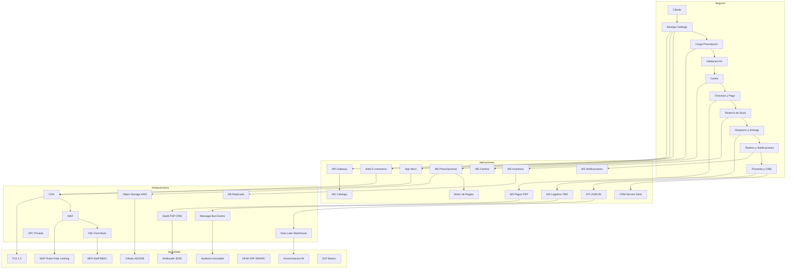
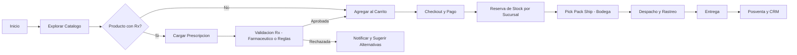
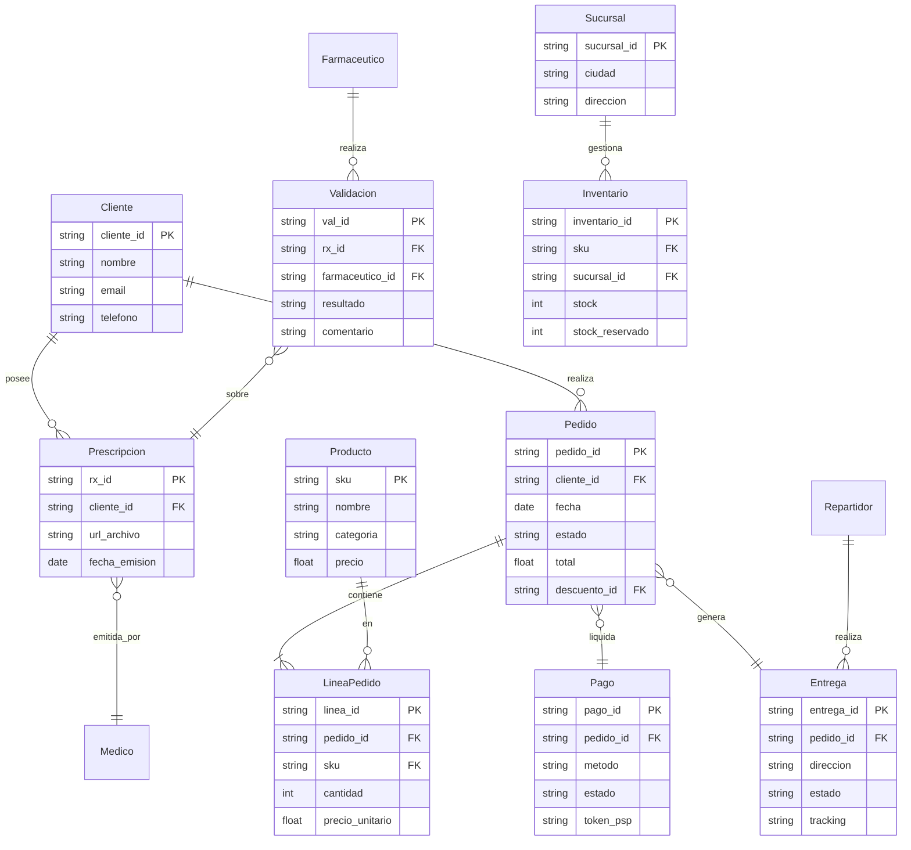
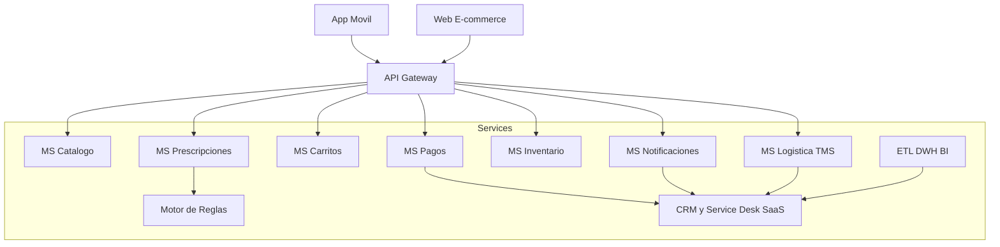
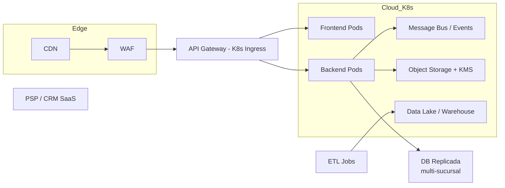

# Taller 7 — Integración de Vistas de Arquitectura (FarmApp)

##  Objetivo
Integrar las vistas de **Negocio, Información, Aplicaciones, Infraestructura y Seguridad** en una narrativa visual y trazable que respalde los objetivos de FarmApp (cadena nacional de farmacias con e-commerce).

---

## 🗺️ Vista Integrada (Mapa en Capas)

> **Lectura:** cada etapa de negocio se alinea con entidades de datos, servicios/apps, componentes de infraestructura y controles de seguridad.

## 🔁 Proceso de Negocio (Compra con Prescripción)

---

##  Modelo de Información (ER)

---

##  Vista de Aplicaciones (Componentes)

---

##  Vista de Infraestructura (Despliegue híbrido)

---

##  Vista de Seguridad (Controles por capa)
- **Identidad y Acceso**: OIDC/OAuth2 para clientes; IAM con RBAC y **MFA** para personal (farmacéuticos, operadores, admins). Segregación de funciones (SoD).
- **Protección de Datos**: **TLS 1.3** en tránsito; cifrado en reposo (**AES‑256** con **KMS**). Pseudonimización/anonimización en analítica. DLP básico para archivos de Rx.
- **Pagos**: Alcance reducido **PCI DSS 4.0** mediante tokenización con PSP; **3DS2**; monitoreo antifraude (reglas + ML si aplica).
- **Aplicación**: WAF, rate limiting, validación de entrada, **OWASP ASVS**; secretos en **Secrets Manager**; logs firmados/append‑only.
- **Infra**: Escaneo de imágenes/CI, políticas de red zero‑trust, rotación de claves, hardening de K8s y nodos.
- **Cumplimiento local**: **Ley 1581 de 2012 (Habeas Data, CO)** para tratamiento de datos personales; consentimiento informado y derechos ARCO.

---

## 🔗 Matriz de Trazabilidad (vista rápida)
Consulta el CSV adjunto `FarmApp_Traceability.csv` para ver el cruce **Negocio ⇄ Datos ⇄ Apps ⇄ Infra ⇄ Seguridad**.

---

##  Cómo presentarlo en clase
1. Abre el TXT **FarmApp_Miro_Prompt.txt** y crea el tablero con 5 swimlanes.
2. Pega las etapas de negocio y repite el patrón de trazabilidad vertical por cada etapa.
3. Exporta una imagen/PDF del tablero y referéncialo en el informe.

---

## Checklist para la rúbrica (5.0)
- [ ] **Integración clara** entre las 5 capas con líneas de trazabilidad.
- [ ] **Aplicado al cliente real** (si adaptan FarmApp): decisiones explícitas (SAGA, tokenización, multi‑sucursal).
- [ ] **Narrativa**: por qué estas decisiones maximizan continuidad del servicio y seguridad.
- [ ] **Investigación**: mención de marcos/estándares (ver referencias).

---

## Referencias y buenas prácticas
- TOGAF Standard: https://www.opengroup.org/togaf
- ArchiMate 3.2: https://pubs.opengroup.org/architecture/archimate3-doc/
- C4 Model: https://c4model.com
- OWASP ASVS 4.0.3: https://owasp.org/www-project-application-security-verification-standard/
- NIST SP 800‑53 r5: https://csrc.nist.gov/publications/sp800-53
- NIST SP 800‑63‑3 (Identidad): https://pages.nist.gov/800-63-3/
- PCI DSS 4.0: https://www.pcisecuritystandards.org
- ISO/IEC 27001:2022: https://www.iso.org/standard/27001
- DAMA‑DMBOK2 (Data Mgmt): https://www.dama.org/content/body-knowledge

---

### Notas
- Sustituye/ajusta entidades y servicios si el **cliente real** del equipo difiere de FarmApp.
- Si no se usa prescripción, omite RX y la validación.
