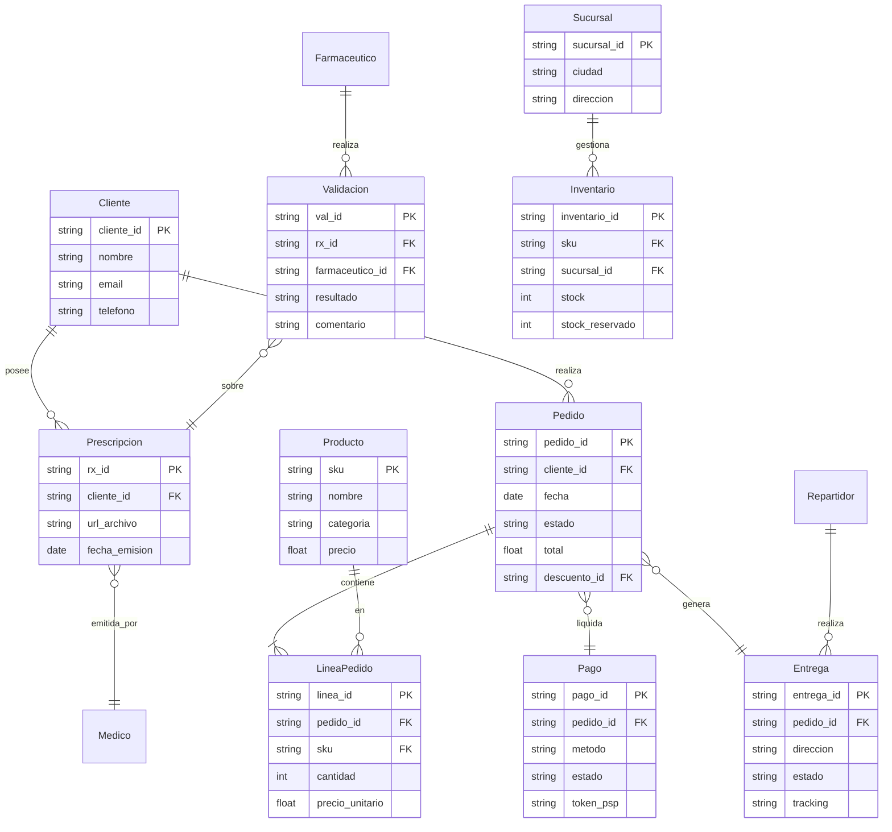

# Taller 7 — Integración de Vistas de Arquitectura (FarmApp)

## 🎯 Objetivo
Integrar las vistas de **Negocio, Información, Aplicaciones, Infraestructura y Seguridad** en una narrativa visual y trazable que respalde los objetivos de FarmApp (cadena nacional de farmacias con e‑commerce).

---

## 🗺️ Vista Integrada (Mapa en Capas)
```mermaid
flowchart TB
  subgraph B["Capa Negocio"]
    B1[Cliente] --> B2[Navega catálogo]
    B2 --> B3[Carga Prescripción]
    B3 --> B4[Validación Rx]
    B4 --> B5[Carrito]
    B5 --> B6[Checkout y Pago]
    B6 --> B7[Reserva de Stock]
    B7 --> B8[Despacho & Entrega]
    B8 --> B9[Rastreo & Notificaciones]
    B9 --> B10[Posventa/CRM]
  end

  subgraph D["Capa Información"]
    D1[(Producto)]:::data --- D2[(Inventario)]:::data --- D3[(Sucursal)]:::data
    D4[(Prescripción)]:::data --- D5[(Cliente)]:::data --- D6[(Farmacéutico)]:::data
    D7[(Pedido)]:::data --- D8[(LíneaPedido)]:::data --- D9[(Pago)]:::data --- D10[(Descuento)]:::data
    D11[(Entrega)]:::data --- D12[(Repartidor)]:::data
  end

  subgraph A["Capa Aplicaciones"]
    A1[App Móvil]:::app --- A2[Web E‑commerce]:::app --- A3[API Gateway]:::app
    A4[MS Catálogo]:::svc --- A5[MS Prescripciones]:::svc --- A6[Motor de Reglas]:::svc
    A7[MS Carritos]:::svc --- A8[MS Pagos (PSP)]:::svc --- A9[MS Inventario]:::svc
    A10[MS Logística/TMS]:::svc --- A11[MS Notificaciones]:::svc --- A12[CRM/Service Desk]:::svc
    A13[ETL/DWH/BI]:::svc
  end

  subgraph I["Capa Infraestructura"]
    I1[CDN]:::infra --- I2[WAF]:::infra --- I3[K8s Front/Back]:::infra
    I4[Object Storage + KMS]:::infra --- I5[DB replicada multi‑sucursal]:::infra --- I6[Message Bus/Events]:::infra
    I7[VPC privada]:::infra --- I8[SaaS PSP/CRM]:::infra --- I9[Data Lake/Warehouse]:::infra
  end

  subgraph S["Capa Seguridad"]
    S1[TLS 1.3]:::sec --- S2[WAF rules/Rate limiting]:::sec --- S3[MFA staff + RBAC]:::sec
    S4[Cifrado en reposo (AES‑256/KMS)]:::sec --- S5[Antifraude/3DS2]:::sec --- S6[Auditoría inmutable]:::sec
    S7[DKIM/SPF/DMARC]:::sec --- S8[Anonimización/Agregación BI]:::sec --- S9[DLP básico]:::sec
  end

  %% Trazabilidad vertical (ejemplos)
  B2 -.-> D1 & D2 & D3
  B3 -.-> D4 & D5
  B6 -.-> D7 & D8 & D9 & D10
  B8 -.-> D11 & D12

  B2 --> A1 & A2 & A3 --> A4
  B3 --> A1 & A2 & A3 --> A5 --> A6
  B5 --> A7
  B6 --> A8
  B7 --> A9
  B8 --> A10
  B9 --> A11 & A12
  B10 --> A12 & A13

  A1 & A2 & A3 --> I1 & I2 & I3
  A5 --> I4
  A4 & A7 & A9 --> I5
  A8 & A12 --> I8
  A10 & A11 --> I6
  A13 --> I9
  I1 & I2 & I3 & I4 & I5 & I6 & I7 & I8 & I9 --> S1 & S2 & S3 & S4 & S5 & S6 & S7 & S8 & S9

  classDef app fill:#eef,stroke:#333;
  classDef svc fill:#def,stroke:#333;
  classDef infra fill:#efe,stroke:#333;
  classDef sec fill:#fee,stroke:#333;
  classDef data fill:#ffd,stroke:#333;
```
> **Lectura:** cada etapa de negocio se alinea con entidades de datos, servicios/apps, componentes de infraestructura y controles de seguridad.

---

## 🔁 Proceso de Negocio (Compra con Prescripción)
```mermaid
flowchart LR
  C0[Inicio] --> C1[Explorar Catálogo]
  C1 --> C2{¿Producto con Rx?}
  C2 -- Sí --> C3[Cargar Prescripción]
  C2 -- No --> C4[Agregar al Carrito]
  C3 --> C5[Validación Rx (farmacéutico/reglas)]
  C5 -- Aprobada --> C4
  C5 -- Rechazada --> C6[Notificar y sugerir alternativas]
  C4 --> C7[Checkout & Pago]
  C7 --> C8[Reserva de Stock por Sucursal]
  C8 --> C9[Pick‑Pack‑Ship (Bodega)]
  C9 --> C10[Despacho y Rastreo]
  C10 --> C11[Entrega]
  C11 --> C12[Posventa/CRM]
```

---

## 🧾 Modelo de Información (ER)


---

## 🧩 Vista de Aplicaciones (Componentes)
```mermaid
flowchart TB
  UI1[App Móvil]:::ui --> APIGW[API Gateway]:::comp
  UI2[Web E‑commerce]:::ui --> APIGW

  subgraph Services
    CAT[MS Catálogo]:::svc
    RX[MS Prescripciones]:::svc
    RULES[Motor de Reglas]:::svc
    CART[MS Carritos]:::svc
    PAY[MS Pagos]:::svc
    INV[MS Inventario]:::svc
    LOG[MS Logística/TMS]:::svc
    NOTI[MS Notificaciones]:::svc
    CRM[CRM/Service Desk (SaaS)]:::ext
    ETL[ETL/DWH/BI]:::svc
  end

  APIGW --> CAT & RX & CART & PAY & INV & LOG & NOTI
  RX --> RULES
  PAY --> CRM
  NOTI --> CRM
  LOG --> CRM
  ETL --> CRM

  classDef ui fill:#eef,stroke:#333;
  classDef comp fill:#dde,stroke:#333;
  classDef svc fill:#def,stroke:#333;
  classDef ext fill:#f5f5f5,stroke:#333,stroke-dasharray: 3 3;
```

---

## 🏗️ Vista de Infraestructura (Despliegue híbrido)
```mermaid
flowchart LR
  subgraph Edge/CDN
    CDN[CDN]:::infra --> WAF[WAF]:::infra
  end

  WAF --> IAPIGW[API Gateway (K8s Ingress)]:::infra

  subgraph Cloud K8s
    FE[Frontend Pods]:::infra
    BE[Backend Pods]:::infra
    MQ[Message Bus/Events]:::infra
    OBJ[Object Storage + KMS]:::infra
    DWH[Data Lake / Warehouse]:::infra
  end

  IAPIGW --> FE & BE
  BE --> MQ
  RXDB[(DB Replicada<br/>multi‑sucursal)]:::db
  BE --> RXDB
  BE --> OBJ
  ETLJ[ETL Jobs]:::infra --> DWH
  SaaS[(PSP/CRM SaaS)]:::ext

  classDef infra fill:#efe,stroke:#333;
  classDef db fill:#ffd,stroke:#333;
  classDef ext fill:#f5f5f5,stroke:#333,stroke-dasharray: 3 3;
```

---

## 🛡️ Vista de Seguridad (Controles por capa)
- **Identidad y Acceso**: OIDC/OAuth2 para clientes; IAM con RBAC y **MFA** para personal (farmacéuticos, operadores, admins). Segregación de funciones (SoD).
- **Protección de Datos**: **TLS 1.3** en tránsito; cifrado en reposo (**AES‑256** con **KMS**). Pseudonimización/anonimización en analítica. DLP básico para archivos de Rx.
- **Pagos**: Alcance reducido **PCI DSS 4.0** mediante tokenización con PSP; **3DS2**; monitoreo antifraude (reglas + ML si aplica).
- **Aplicación**: WAF, rate limiting, validación de entrada, **OWASP ASVS**; secretos en **Secrets Manager**; logs firmados/append‑only.
- **Infra**: Escaneo de imágenes/CI, políticas de red zero‑trust, rotación de claves, hardening de K8s y nodos.
- **Cumplimiento local**: **Ley 1581 de 2012 (Habeas Data, CO)** para tratamiento de datos personales; consentimiento informado y derechos ARCO.

---

## 🔗 Matriz de Trazabilidad (vista rápida)
Consulta el CSV adjunto `FarmApp_Traceability.csv` para ver el cruce **Negocio ⇄ Datos ⇄ Apps ⇄ Infra ⇄ Seguridad**.

---

## 🧪 Cómo presentarlo en clase
1. Abre el TXT **FarmApp_Miro_Prompt.txt** y crea el tablero con 5 swimlanes.
2. Pega las etapas de negocio y repite el patrón de trazabilidad vertical por cada etapa.
3. Exporta una imagen/PDF del tablero y referéncialo en el informe.

---

## 📝 Checklist para la rúbrica (5.0)
- [ ] **Integración clara** entre las 5 capas con líneas de trazabilidad.
- [ ] **Aplicado al cliente real** (si adaptan FarmApp): decisiones explícitas (SAGA, tokenización, multi‑sucursal).
- [ ] **Narrativa**: por qué estas decisiones maximizan continuidad del servicio y seguridad.
- [ ] **Investigación**: mención de marcos/estándares (ver referencias).

---

## 📚 Referencias y buenas prácticas
- TOGAF Standard: https://www.opengroup.org/togaf
- ArchiMate 3.2: https://pubs.opengroup.org/architecture/archimate3-doc/
- C4 Model: https://c4model.com
- OWASP ASVS 4.0.3: https://owasp.org/www-project-application-security-verification-standard/
- NIST SP 800‑53 r5: https://csrc.nist.gov/publications/sp800-53
- NIST SP 800‑63‑3 (Identidad): https://pages.nist.gov/800-63-3/
- PCI DSS 4.0: https://www.pcisecuritystandards.org
- ISO/IEC 27001:2022: https://www.iso.org/standard/27001
- DAMA‑DMBOK2 (Data Mgmt): https://www.dama.org/content/body-knowledge

---

### Notas
- Sustituye/ajusta entidades y servicios si el **cliente real** del equipo difiere de FarmApp.
- Si no se usa prescripción, omite RX y la validación.